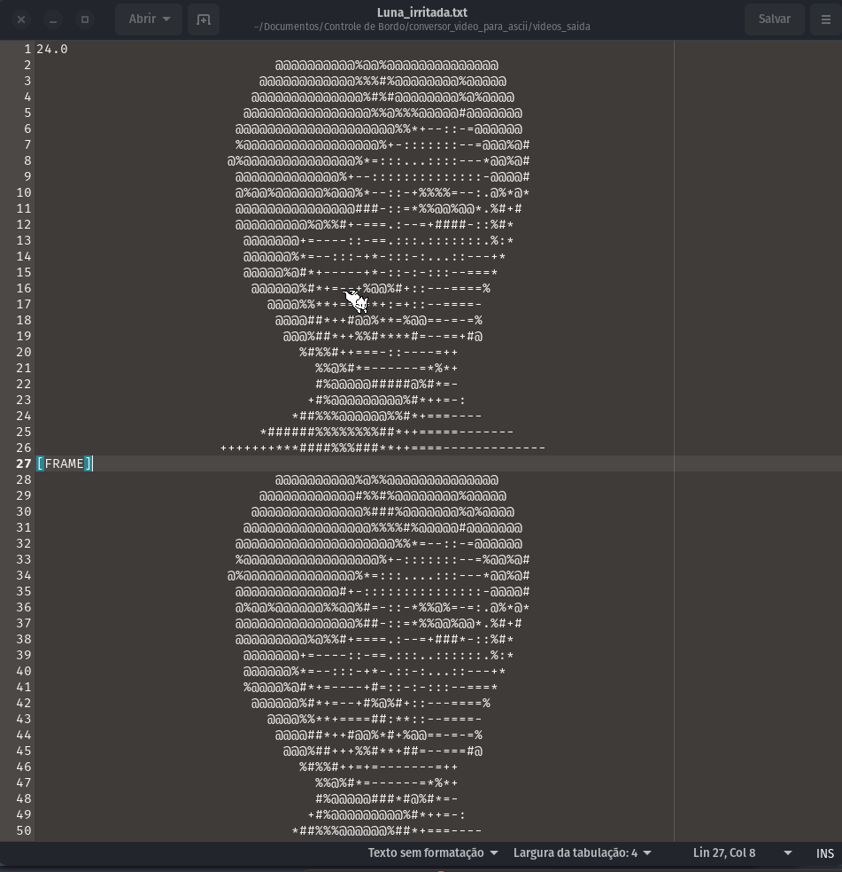
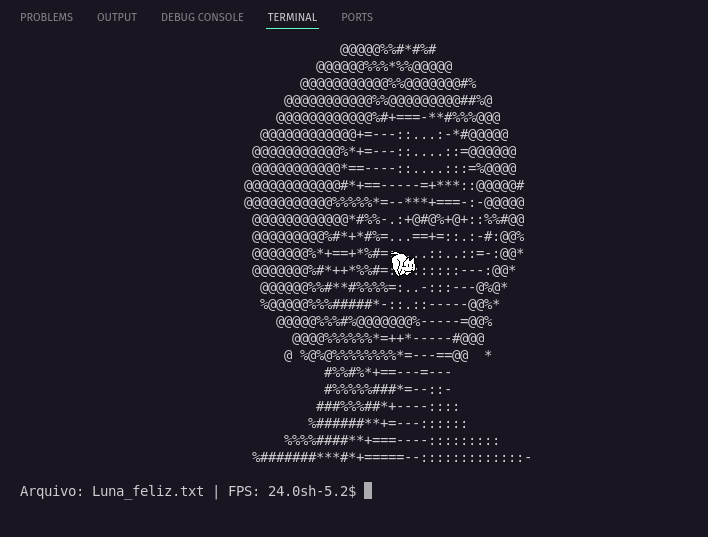

<div align="center">
  
[](#)
[](https://www.gnu.org/licenses/gpl-3.0)
[](https://www.python.org/)
[](https://github.com/AndreBFarias/ArteAsciiConversor/stargazers)
[](https://github.com/AndreBFarias/ArteAsciiConversor/issues)

<div align="center">
<div style="text-align: center;">
  <h1 style="font-size: 2em;">Êxtase em Arte ASCII: Conversor de Vídeos para TXT</h1>
  
</div>
</div></div>

### Descrição
Um ritual de magia negra digital que transmuda vídeos em animações ASCII, banindo fundos verdes com chroma key e evocando silhuetas em caracteres que dançam no terminal. Perfeito pra quem anseia por arte crua, onde cada frame é um sussurro fatal de luz e sombra. Processa múltiplos vídeos de uma pasta, salva em TXT, e projeta no terminal com loop eterno se desejado.

### Foco nos Rituais
Cada script é um sussurro de poder, evocando arte das sombras. Aqui, destaque pra cada um, com visão que hipnotiza.

> #### `main.py`: O Alquimista Principal
> 

> Este é o coração pulsante, que devora vídeos da pasta entrada, remove fundos com chroma key e transmuta em TXT ASCII. Rápido, brutal, processa múltiplos de uma vez, salvando silhuetas que dançam eternas. Invoque com `python3 main.py` pra ver o caos se render à forma.

> #### `calibrator.py`: O Guardião do Chroma Key
> 

> Pra banir fundos verdes com precisão fatal, este calibre o chroma key, ajustando tons como quem acaricia uma lâmina. Use `python3 calibrator.py [--video nome.mp4]` pra testar e refinar, garantindo silhuetas puras, sem resquícios de luz indesejada.

> #### `player.py`: O Projetor de Sombras
> 

> Evoca os TXT no terminal, fazendo caracteres dançarem com loop infinito se desejado. Projete um com `python3 player.py --arquivo videos_saida/seu_video.txt [--loop sim]`, ou todos em sequência com `python3 player.py` – um ballet sombrio que hipnotiza o olhar.

### Instalação
- Clone o repositório: 
  > git clone [https://github.com/AndreBFarias/Extase-em-Arte-ASCII](https://github.com/AndreBFarias/Extase-em-Arte-ASCII) 
- Instale dependências: 
  > pip install -r requirements.txt.
- Crie pastas: mkdir videos_entrada videos_saida.
- Edite config.ini pra caminhos e defaults do player
- Converta todos vídeos da pasta entrada: 
  > python3 main.py.
- Calibre chroma key: 
  > python3 calibrator.py [--video nome.mp4]
- Projete um TXT: 
  > python3 player.py --arquivo videos_saida/seu_video.txt 
- Projete todos TXT da saída em sequência: 
  >python3 player.py 

### Configuração (config.ini)
```
[Pastas]
-input_dir = videos_entrada
-output_dir = videos_saida

[Player]
-arquivo = videos_saida/Luna_feliz.txt
-loop = sim
-all = nao
```
### Dependências
```-opencv-python
-numpy
-configparser
```

### Licença GLP
>Livre para modificar e usar da forma que preferir desde que tudo permaneça livre.
