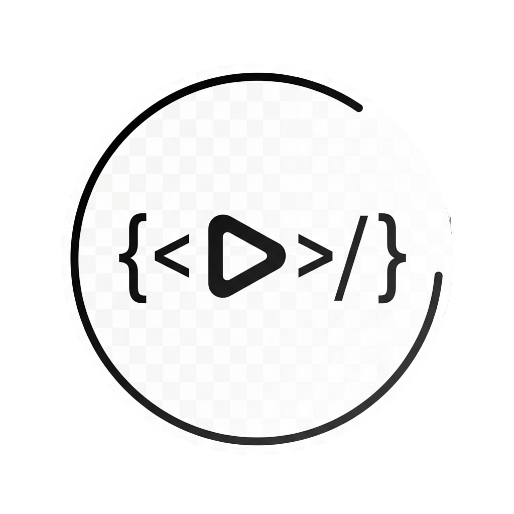
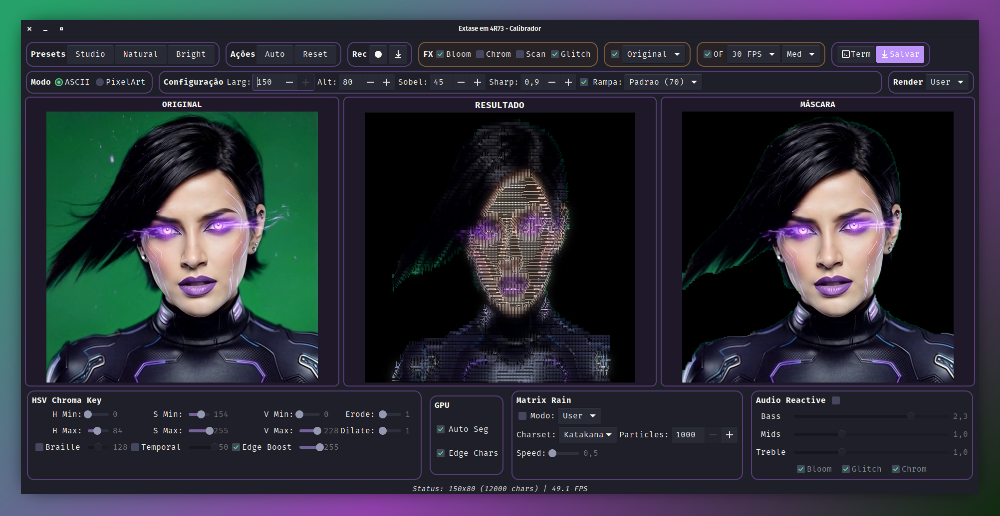

<div align="center">

[](#)
[](https://www.gnu.org/licenses/gpl-3.0)
[](https://www.python.org/)
[](https://www.gtk.org/)
[](https://github.com/AndreBFarias/Conversor-Video-Para-ASCII/stargazers)
[](https://github.com/AndreBFarias/Conversor-Video-Para-ASCII/issues)

<div align="center">
<div style="text-align: center;">
  <h1 style="font-size: 2.2em;">Extase em 4R73</h1>
  
</div>
</div>
</div>

---

### Descricao
Conversor de video para ASCII art em tempo real com aceleracao GPU (CUDA), sistema de temas Dark/Light, efeitos visuais PostFX e modos especiais como Unicode Braille (4x resolucao) e High Fidelity Texture.

---

### Principais Funcionalidades

| Categoria | Funcionalidade |
|-----------|---------------|
| **Renderizacao** | ASCII Colorido, Pixel Art, Unicode Braille (4x res), High Fidelity |
| **Performance** | GPU CUDA (CuPy), Async Streams, 60+ FPS |
| **Chroma Key** | Calibrador GTK em tempo real, Presets (Studio/Natural/Bright) |
| **Efeitos PostFX** | Bloom Neon, Chromatic Aberration, Scanlines CRT, Glitch Digital |
| **Matrix Rain** | Sistema de particulas GPU, modos Katakana/Binary/Symbols |
| **Audio Reactive** | Modulacao por frequencia (Bass/Mids/Treble) |
| **Optical Flow** | Interpolacao de frames (15 FPS para 60 FPS) |
| **Interface** | Tema Dark/Light, GTK3 moderno, Player integrado |
| **Exportacao** | TXT, MP4, GIF, HTML standalone |
| **Deploy** | AppImage, Flatpak, .deb |

---

### Interface

<div align="center">

</div>

---

### Calibrador Chroma Key

<div align="center">

</div>

---

### Instalacao

#### AppImage (Universal - Recomendado)

```bash
# Baixar da pagina de releases
chmod +x Extase_em_4R73-*.AppImage
./Extase_em_4R73-*.AppImage
```

#### Flatpak

```bash
flatpak install extase-em-4r73.flatpak
flatpak run com.github.andrebfarias.extase-em-4r73
```

#### Ubuntu/Debian (.deb)

```bash
wget https://github.com/AndreBFarias/Conversor-Video-Para-ASCII/releases/latest/download/extase-em-4r73_2.4.0_all.deb
sudo dpkg -i extase-em-4r73_2.4.0_all.deb
sudo apt-get install -f
extase-em-4r73
```

#### Via Script (Desenvolvimento)

```bash
git clone https://github.com/AndreBFarias/Conversor-Video-Para-ASCII.git
cd Conversor-Video-Para-ASCII
chmod +x install.sh
./install.sh
```

---

### Requisitos

**Obrigatorios:**
- Python 3.10+
- GTK 3.0
- NumPy, OpenCV, Pillow
- FFmpeg

**Recomendados (GPU):**
- GPU NVIDIA (RTX 2000+)
- CUDA 12.x
- CuPy

**Opcionais:**
- kitty/gnome-terminal (preview ASCII)
- PortAudio (audio-reactive)
- MediaPipe (segmentacao automatica)

---

### Uso

**Via menu de aplicativos:** Procure por "Extase em 4R73"

**Via terminal:**
```bash
cd Conversor-Video-Para-ASCII
source venv/bin/activate
python3 main.py
```

---

### Atalhos do Calibrador

| Tecla | Acao |
|-------|------|
| A | Auto-detectar verde |
| R | Resetar valores |
| S | Salvar configuracao |
| T | Abrir terminal externo |
| Q/ESC | Sair |

---

### Modos de Renderizacao

| Modo | Descricao |
|------|-----------|
| **ASCII Colorido** | Caracteres ASCII com cores ANSI 24-bit |
| **High Fidelity** | Mapeamento MSE de textura por bloco |
| **Unicode Braille** | 4x resolucao usando U+2800-U+28FF |
| **Pixel Art** | Paletas retro (GameBoy, NES, C64, PICO-8) |
| **Matrix Rain** | Particulas com fisica GPU |

---

### Efeitos PostFX

- **Bloom Neon**: Brilho em areas claras
- **Chromatic Aberration**: Separacao RGB nas bordas
- **Scanlines CRT**: Linhas horizontais estilo monitor antigo
- **Glitch Digital**: Artefatos aleatorios de corrupcao

---

### Paletas Pixel Art

| Paleta | Cores |
|--------|-------|
| Game Boy | 4 |
| CGA | 16 |
| NES | 54 |
| Commodore 64 | 16 |
| PICO-8 | 16 |
| Grayscale | 8 |
| Sepia | 8 |
| Cyberpunk Neon | 12 |
| Dracula | 11 |
| Monitor Verde CRT | 12 |

---

### Estrutura do Projeto

```
Conversor-Video-Para-ASCII/
├── main.py              # Entry point
├── config.ini           # Configuracoes
├── install.sh           # Instalacao
├── uninstall.sh         # Desinstalacao
├── requirements.txt     # Dependencias Python
├── src/
│   ├── app/             # Aplicacao GTK principal
│   ├── core/            # Conversores (CPU/GPU)
│   └── gui/             # Arquivos Glade
├── assets/              # Icones e imagens
├── docs/                # Documentacao
├── tests/               # Testes (pytest)
└── packaging/           # Scripts de build
```

---

### Documentacao

- [Referencia de Configuracao](docs/CONFIG_REFERENCE.md)
- [Guia de Presets](docs/PRESETS_REFERENCE.md)
- [Guia de Testes](docs/TESTING_GUIDE.md)

---

### Contribuindo

Contribuicoes sao bem-vindas. Veja [CONTRIBUTING.md](docs/CONTRIBUTING.md) para detalhes.

---

### Licenca

GPLv3 - Veja [LICENSE](LICENSE) para detalhes.
