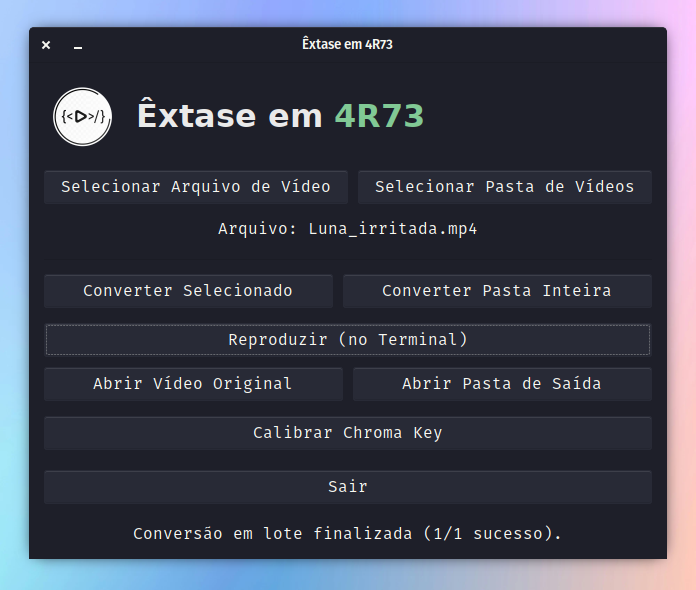
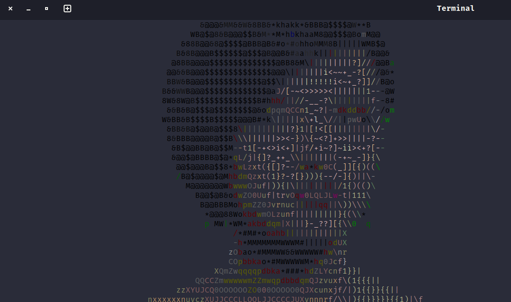
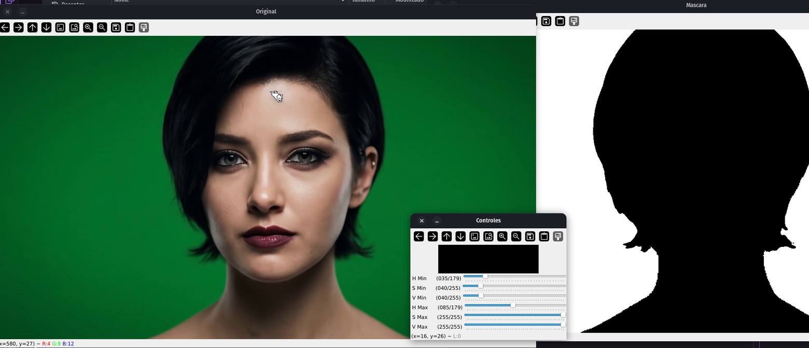

<div align="center">

[](#)
[](https://www.gnu.org/licenses/gpl-3.0)
[](https://www.python.org/)
[](https://github.com/AndreBFarias/Conversor-Video-Para-ASCII/stargazers) [](https://github.com/AndreBFarias/Conversor-Video-Para-ASCII/issues) <div align="center">
<div style="text-align: center;">
  <h1 style="font-size: 2.2em;">Êxtase em <span style="color:#81c995;">4R73</span>: Conversor de Vídeos para Arte ASCII</h1>
  
</div>
</div></div>

### Descrição
Um ritual de magia digital que transmuda vídeos em animações ASCII coloridas, banindo fundos indesejados (como *chroma key*) e evocando silhuetas em caracteres que dançam no terminal. Perfeito para quem anseia por arte crua, onde cada frame é um sussurro de luz e sombra. Processa múltiplos vídeos de uma pasta, salva em formato `.txt` otimizado, e projeta no terminal com loop eterno se desejado.

### Rituais (Funcionalidades da Interface)

O grimório principal é invocado com `python3 main.py`, abrindo o Altar de Transmutação (GUI).

> #### O Altar Principal (`main.py`)
> 

A partir daqui, os seguintes rituais estão disponíveis:

1.  **Seleção (Arquivo ou Pasta):**
    * **Selecionar Arquivo:** Marca um único vídeo para sacrifício (`.mp4`, `.mkv`, `.avi`, `.mov`, `.webm`).
    * **Selecionar Pasta:** Marca um diretório inteiro. Todos os vídeos compatíveis dentro dele serão processados em lote.

2.  **A Transmutação (Conversão):**
    * **Converter Selecionado:** Inicia a conversão apenas do arquivo de vídeo selecionado.
    * **Converter Pasta Inteira:** Inicia um ritual em lote, convertendo todos os vídeos da pasta selecionada (ou da `input_dir` padrão no `config.ini`). O processo bane o *chroma key* (conforme configurado) e sela a essência do vídeo em arquivos `.txt` na pasta `output_dir`.

> #### O Projetor de Sombras (`main_cli.py` / `player.py`)
> 

3.  **A Projeção (Playback):**
    * **Reproduzir (no Terminal):** Invoca um novo terminal (`gnome-terminal` ou `xterm`) e projeta a arte ASCII (`.txt`) correspondente ao vídeo selecionado, usando as cores ANSI 256.

> #### O Triptych / O Oráculo (`calibrator.py`)
> 

4.  **A Calibração (O Triptych):**
    * **Calibrar Chroma Key:** O ritual mais complexo. Abre três portais simultâneos:
        * **Janela 1 (Vídeo Original):** A realidade crua (sua webcam ou o vídeo selecionado).
        * **Janela 2 (Vídeo Filtro):** O resultado do filtro chroma key aplicado em tempo real.
        * **Janela 3 (Terminal):** A transmutação ASCII *em tempo real* do vídeo original, com as áreas filtradas pelo chroma key substituídas por espaços.
    * Use os controles deslizantes (em janela separada) para ajustar os valores HSV (Matiz, Saturação, Valor) do filtro e pressione `s` para selar (salvar) os valores no `config.ini`. Pressione `q` para sair sem salvar.

5.  **Abertura de Portais (Utilitários):**
    * **Abrir Vídeo Original:** Abre o arquivo de vídeo (`.mp4`, etc.) selecionado no seu player de vídeo padrão.
    * **Abrir Pasta de Saída:** Abre o diretório `output_dir` (definido no `config.ini`) onde os arquivos `.txt` transmutados repousam.

### Instalação (Linux - Debian/Ubuntu)

1.  **Clone o Repositório:**
    ```bash
    git clone [https://github.com/AndreBFarias/Conversor-Video-Para-ASCII.git](https://github.com/AndreBFarias/Conversor-Video-Para-ASCII.git)
    cd Conversor-Video-Para-ASCII
    ```
2.  **Execute o Ritual de Consagração:**
    ```bash
    chmod +x install.sh
    ./install.sh
    ```
    *(Este script instalará dependências do sistema via `apt`, criará um ambiente virtual `venv`, instalará pacotes Python via `pip`, criará as pastas `videos_entrada`/`videos_saida`, e adicionará um lançador ao seu menu de aplicativos com o ícone.)*

### Uso

* **Via Menu de Aplicativos:** Procure por "Êxtase em 4R73".
* **Manualmente (Terminal):**
    ```bash
    cd /caminho/para/Conversor-Video-Para-ASCII
    source venv/bin/activate
    python3 main.py
    ```

### Desinstalação

Navegue até a pasta do projeto e execute o Ritual de Banimento:
```bash
chmod +x uninstall.sh
./uninstall.sh
(Este script removerá o ambiente virtual, o ícone, o lançador do menu e perguntará se você deseja apagar as pastas videos_entrada e videos_saida.)

Configuração (config.ini)
Edite o arquivo config.ini na raiz do projeto para ajustar os parâmetros:

Ini, TOML

[Pastas]
input_dir = videos_entrada  # Pasta onde a GUI procura vídeos
output_dir = videos_saida   # Pasta onde os arquivos .txt são salvos

[Player]
# Opções de fallback para main_cli.py (se executado sem -f)
arquivo = videos_saida/Luna_feliz.txt
loop = sim                   # 'sim' ou 'nao'

[Conversor]
# Largura da animação ASCII (em caracteres)
target_width = 120
# Sensibilidade para detecção de bordas (0-255)
sobel_threshold = 100
# Proporção largura/altura do caractere da fonte do terminal
char_aspect_ratio = 0.45
# Mapeamento de brilho para caracteres (Escuro -> Claro)
LUMINANCE_RAMP = $@B8&WM#*oahkbdpqwmZO0QLCJUYXzcvunxrjft/\|()1{}[]?-_+~<>i!lI;:,"^`'.

[ChromaKey]
# Valores HSV para o filtro (ajustados pelo Calibrador)
# H: 0-179, S: 0-255, V: 0-255
h_min = 35
h_max = 85
s_min = 40
s_max = 255
v_min = 40
v_max = 255
Dependências
Python 3.8+

- Bibliotecas Python (instaladas via pip no venv):

opencv-python

numpy

- Dependências do Sistema (instaladas via apt pelo install.sh):

python3-pip, python3-venv

python3-opencv (Interface OpenCV do sistema)

python3-gi, python3-gi-cairo, gir1.2-gtk-3.0 (Para a interface GTK)

desktop-file-utils, imagemagick (Para integração com o desktop)
```
### Licença

Este projeto está sob a licença GPLv3. Livre para usar, modificar e distribuir, desde que a liberdade seja mantida.
