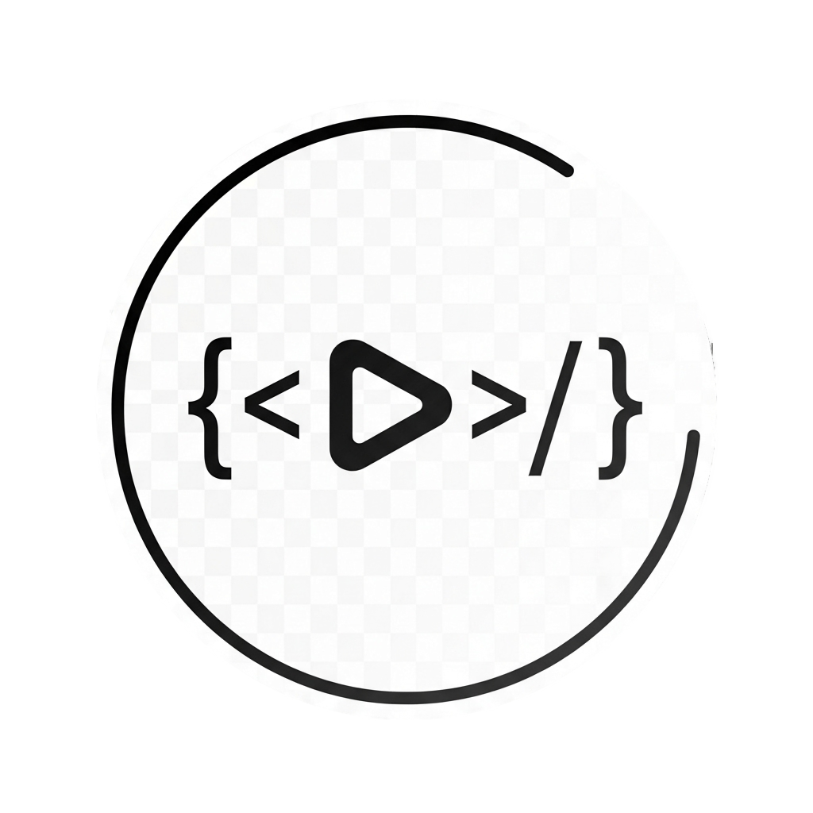
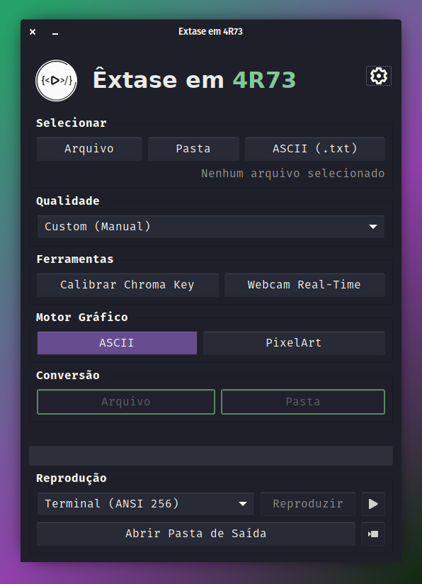
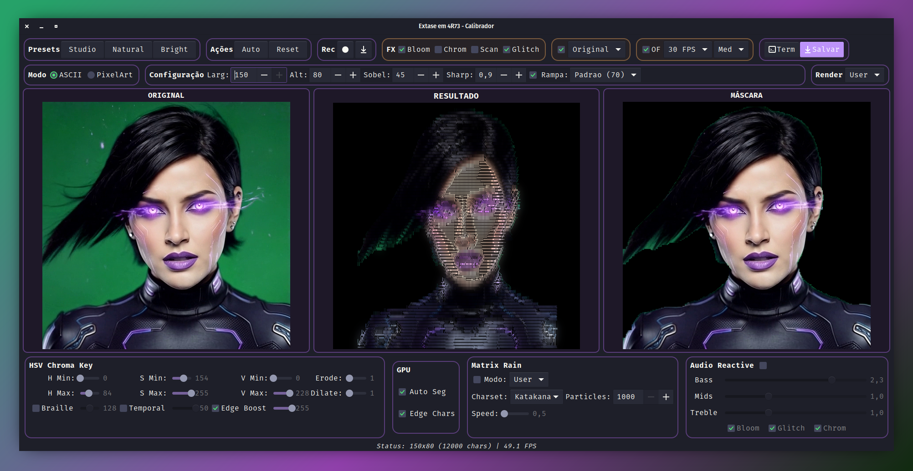

<div align="center">

[](#)
[](https://www.gnu.org/licenses/gpl-3.0)
[](https://www.python.org/)
[](https://www.gtk.org/)
[](https://github.com/[REDACTED]/Conversor-Video-Para-ASCII/stargazers)
[](https://github.com/[REDACTED]/Conversor-Video-Para-ASCII/issues)

<div align="center">
<div style="text-align: center;">
  <h1 style="font-size: 2.2em;">Extase em 4R73</h1>
  
</div>
</div>
</div>

---

### Descrição
Conversor de vídeo para ASCII art em tempo real com aceleração GPU (CUDA), sistema de temas Dark/Light, efeitos visuais PostFX e modos especiais como Unicode Braille (4x resolução) e High Fidelity Texture.

---

### Principais Funcionalidades

| Categoria | Funcionalidade |
|-----------|---------------|
| **Renderização** | ASCII Colorido, Pixel Art, Unicode Braille (4x res), High Fidelity |
| **Performance** | GPU CUDA (CuPy), Async Streams, 60+ FPS |
| **Chroma Key** | Calibrador GTK em tempo real, Presets (Studio/Natural/Bright), Auto Seg (MediaPipe) |
| **Edge Boost** | Realce de bordas para ASCII denso, chars especiais de borda, controle de intensidade |
| **Temporal Coherence** | Redução de flickering entre frames, threshold ajustável |
| **Efeitos PostFX** | Bloom Neon, Chromatic Aberration, Scanlines CRT, Glitch Digital |
| **Matrix Rain** | Sistema de partículas GPU, modos Katakana/Binary/Symbols |
| **Audio Reactive** | Modulação por frequência (Bass/Mids/Treble) |
| **Optical Flow** | Interpolação de frames (15 FPS para 60 FPS) |
| **Interface** | Tema Dark/Light, GTK3 moderno, Player integrado, UI reorganizada |
| **Exportação** | TXT, MP4, GIF, HTML standalone, PNG |
| **Deploy** | AppImage, Flatpak, .deb |

---

### Interface

<div align="center">

</div>

---

### Calibrador Chroma Key

<div align="center">

</div>

---

### Instalação

#### AppImage (Universal - Recomendado)

```bash
# Baixar da página de releases
chmod +x Extase_em_4R73-*.AppImage
./Extase_em_4R73-*.AppImage
```

#### Flatpak

```bash
flatpak install extase-em-4r73.flatpak
flatpak run com.github.andrebfarias.extase-em-4r73
```

#### Ubuntu/Debian (.deb)

```bash
wget https://github.com/[REDACTED]/Conversor-Video-Para-ASCII/releases/latest/download/extase-em-4r73_2.5.0_all.deb
sudo dpkg -i extase-em-4r73_2.5.0_all.deb
sudo apt-get install -f
extase-em-4r73
```

#### Via Script (Desenvolvimento)

```bash
git clone https://github.com/[REDACTED]/Conversor-Video-Para-ASCII.git
cd Conversor-Video-Para-ASCII
chmod +x install.sh
./install.sh
```

---

### Requisitos

**Obrigatórios:**
- Python 3.10+
- GTK 3.0
- NumPy, OpenCV, Pillow
- FFmpeg

**Recomendados (GPU):**
- GPU NVIDIA (RTX 2000+)
- CUDA 12.x
- CuPy

**Opcionais:**
- kitty/gnome-terminal (preview ASCII)
- PortAudio (audio-reactive)
- MediaPipe (segmentação automática)

---

### Uso

**Via menu de aplicativos:** Procure por "Extase em 4R73"

**Via terminal (GUI):**
```bash
cd Conversor-Video-Para-ASCII
source venv/bin/activate
python3 main.py
```

**Via CLI (headless, sem display):**
```bash
source venv/bin/activate

# Diagnóstico do sistema
python cli.py info

# Converter video para MP4
python cli.py convert --video data_input/video.mp4 --format mp4 --quality low

# Converter video para HTML com audio
python cli.py convert --video data_input/video.mp4 --format html

# Ver/alterar configuração
python cli.py config show
python cli.py config presets

# Validar integridade
python cli.py validate --video data_input/video.mp4
```

Documentação completa do CLI: [docs/CLI_GUIDE.md](docs/CLI_GUIDE.md)

---

### Atalhos do Calibrador

| Tecla | Ação |
|-------|------|
| Space | Pausar/retomar vídeo |
| A | Auto-detectar verde |
| R | Resetar valores |
| S | Salvar configuração |
| T | Abrir terminal externo |
| Q/ESC | Sair |

---

### Modos de Renderização

| Modo | Descrição |
|------|-----------|
| **ASCII Colorido** | Caracteres ASCII com cores ANSI 24-bit |
| **High Fidelity** | Mapeamento MSE de textura por bloco |
| **Unicode Braille** | 4x resolução usando U+2800-U+28FF |
| **Pixel Art** | Paletas retro (GameBoy, NES, C64, PICO-8) |
| **Matrix Rain** | Partículas com física GPU |

---

### Efeitos PostFX

- **Bloom Neon**: Brilho em áreas claras
- **Chromatic Aberration**: Separação RGB nas bordas
- **Scanlines CRT**: Linhas horizontais estilo monitor antigo
- **Glitch Digital**: Artefatos aleatórios de corrupção

---

### Paletas Pixel Art

| Paleta | Cores |
|--------|-------|
| Game Boy | 4 |
| CGA | 16 |
| NES | 54 |
| Commodore 64 | 16 |
| PICO-8 | 16 |
| Grayscale | 8 |
| Sepia | 8 |
| Cyberpunk Neon | 12 |
| Dracula | 11 |
| Monitor Verde CRT | 12 |

---

### Estrutura do Projeto

```
Conversor-Video-Para-ASCII/
  main.py              # Entry point (GUI GTK)
  cli.py               # CLI unificado (headless)
  config.ini           # Configurações
  install.sh           # Instalação
  uninstall.sh         # Desinstalação
  requirements.txt     # Dependências Python
  src/
    app/               # Aplicação GTK principal
    core/              # Conversores (CPU/GPU)
    gui/               # Arquivos Glade
  assets/              # Ícones e imagens
  docs/                # Documentação
  tests/               # Testes (pytest)
  packaging/           # Scripts de build
```

---

### Documentação

- [Guia do CLI](docs/CLI_GUIDE.md)
- [Referência de Configuração](docs/CONFIG_REFERENCE.md)
- [Guia de Presets](docs/PRESETS_REFERENCE.md)
- [Guia de Testes](docs/TESTING_GUIDE.md)

---

### Contribuindo

Contribuições são bem-vindas. Veja [CONTRIBUTING.md](docs/CONTRIBUTING.md) para detalhes.

---

### Licença

GPLv3 - Veja [LICENSE](LICENSE) para detalhes.
